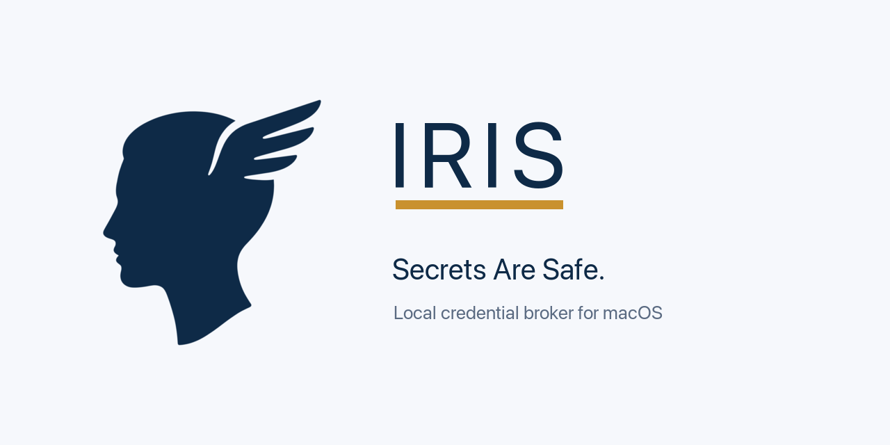

<p align="center">
  <picture>
    <source media="(prefers-color-scheme: dark)" srcset="assets/banner-dark.png">
    
  </picture>
</p>

<p align="center">
  <a href="https://github.com/Sandjab/Iris/actions/workflows/ci.yml"></a>
  
  
  <a href="LICENSE"></a>
</p>

> **IRIS: Interception · Resolution · Injection · Substitution**

A minimal credential broker for macOS that lets local AI agents (like Claude Code CLI) use real credentials without ever seeing them.

Named after the Greek messenger goddess who carried messages between worlds without altering them: IRIS sits between your agent and the upstream APIs, carrying authenticated requests through while keeping the actual credentials on the far side of a trust boundary.

IRIS runs as a background LaunchAgent paired with a menu bar app — both register with `SMAppService` on first launch and relaunch automatically at every login. It exposes a local HTTPS proxy that intercepts outbound traffic, substitutes placeholders like `{{kc:anthropic_api_key}}` with real values pulled from the macOS Keychain, and forwards the request upstream. The agent's process environment only ever contains the placeholders.

## Why

AI coding agents are vulnerable by design: prompt injection, malicious files in repos, and unsanitized tool outputs can all trick an agent into exfiltrating its credentials. The right fix is to put a trust boundary between the agent and the secrets — the agent does work, the broker holds the keys.

IRIS is a single-user, single-machine implementation of that pattern. No cloud, no team accounts, no telemetry.

## Features

- Local HTTPS MITM proxy with per-host whitelist (anything not whitelisted is CONNECT pass-through, no decryption).
- Per-secret `allowed_hosts` scoping: each secret can only be substituted into requests going to its authorized destinations. Anthropic key cannot leak to GitHub even if the agent tries.
- Exfiltration attempt detection with five distinct heuristics, surfaced as alerts in the menu bar app.
- Secrets stored in the macOS System Keychain with an ACL that grants silent access only to the signed `irisd` binary.
- Menu bar app for live monitoring, secret management, and alerts.
- CLI for scripting and headless usage.
- Single signed and notarized `.pkg` installer.

## How IRIS compares to existing approaches

Several mechanisms exist to manage credentials for AI coding agents. They sit at different layers and make different trade-offs.

|  | IRIS | Agent Vault (Infisical) | `apiKeyHelper` (native) | `op run` (1Password) | Claude Code sandbox |
|---|---|---|---|---|---|
| Secret never enters agent's process env | ✅ | ✅ | ❌ resolved into process | ❌ injected at launch | ❌ except Docker plugin |
| Covers MCP server tokens | ✅ | ✅ | ❌ Anthropic key only | ✅ | partial |
| Covers Bash tools (`gh`, `aws`, etc.) | ✅ | ✅ | ❌ | ✅ (env inheritance) | ✅ |
| Per-destination scoping | ✅ | partial | ❌ | ❌ | host allowlist |
| Exfiltration detection | ✅ 5 rules | basic logs | ❌ | ❌ | ❌ |
| Native macOS UI | ✅ menu bar | ❌ | ❌ | ❌ | ❌ |
| Local-only, single-user focus | ✅ | ❌ cloud-first | ✅ | ✅ | ✅ |
| Pre-existing | new | yes | yes | yes | yes |

**Position**: IRIS is the only option that keeps the secret out of the agent's process *and* enforces per-destination scoping *and* surfaces exfiltration attempts in a native UI. If you only need the Anthropic key managed with minimal effort and accept that it lives in `process.env`, `op run -- claude` is faster to set up and entirely sufficient.

## Incompatibility with `apiKeyHelper`

IRIS does not coexist with Claude Code's `apiKeyHelper` setting. This is by design.

The Claude Code bug [anthropics/claude-code#2646](https://github.com/anthropics/claude-code/issues/2646) means that when `apiKeyHelper` is set, `HTTPS_PROXY` is not honored for inference requests, bypassing IRIS for the Anthropic API call. Rather than implementing a parallel reverse-proxy mechanism, IRIS commits to one unified path: MITM forward proxy for everything.

If you currently use `apiKeyHelper`, `op run -- claude`, the Docker sandbox plugin, or Cordon, you'll need to remove those before using IRIS. The migration is straightforward:

```bash
iris secret add anthropic_api_key --allowed-hosts api.anthropic.com --value-from-stdin
# Then remove apiKeyHelper from ~/.claude/settings.json and any project-level settings
# Then set ANTHROPIC_API_KEY='{{kc:anthropic_api_key}}' in your shell profile
```

`iris doctor` checks for and flags any residual `apiKeyHelper` configuration.

## Quickstart

```bash
# Install — double-click Iris.pkg for the guided installer,
# or headless from the CLI:
sudo installer -pkg Iris.pkg -target /

# Add your first secret — read it without leaving a trace in shell history
read -rs ANTHROPIC_KEY
printf %s "$ANTHROPIC_KEY" | iris secret add anthropic_api_key \
  --allowed-hosts api.anthropic.com \
  --value-from-stdin

# Configure your shell (one-time, in ~/.zshrc)
export HTTPS_PROXY="http://127.0.0.1:8888"
export NODE_EXTRA_CA_CERTS="$HOME/Library/Application Support/iris/ca.pem"
export SSL_CERT_FILE="$NODE_EXTRA_CA_CERTS"
export ANTHROPIC_API_KEY='{{kc:anthropic_api_key}}'

# Use Claude Code as usual — your real key never enters its process
claude
```

After install, the daemon and the menu bar app both start on their own — and relaunch at every login. The menu bar icon appears in the top-right; click it for live logs, alerts, and secret management. You can toggle either service's auto-start from **Settings → "Launch at login"**.

## Architecture

```
┌──────────────────────────────────┐
│  Claude Code (or any HTTPS tool) │
│  ENV: ANTHROPIC_API_KEY=         │
│       "{{kc:anthropic_api_key}}" │
│  HTTPS_PROXY=127.0.0.1:8888      │
└────────────┬─────────────────────┘
             │ HTTPS (TLS via local CA)
             ▼
┌──────────────────────────────────┐         ┌─────────────────────┐
│  irisd (LaunchAgent)             │         │  System Keychain    │
│  ├─ MITM proxy   :8888           │◄────────┤  (secrets + CA key) │
│  ├─ Events SSE   :8899           │         └─────────────────────┘
│  └─ Admin RPC    unix socket     │
└────────────┬─────────────────────┘
             │ HTTPS (clean, with real credential)
             ▼
         Upstream API
         (api.anthropic.com, api.github.com, …)
```

The menu bar app and CLI both talk to the daemon over the Unix domain socket for control operations, and over the local HTTP/SSE endpoint for event streams.

## Configuration

A single JSON file owned by the daemon, seeded with defaults on first run and
edited via the CLI/app (`iris config set`, `iris rule add/rm`) — never by hand:
`~/Library/Application Support/iris/config.json`:

```json
{
  "version": 1,
  "broker": {
    "listen": "127.0.0.1:8888",
    "events_listen": "127.0.0.1:8899",
    "admin_socket": "~/Library/Application Support/iris/admin.sock",
    "log_level": "info",
    "event_retention_days": 7,
    "event_ring_size": 10000
  },
  "security": {
    "on_exfil_attempt": "block_and_notify",
    "max_substitutions_per_minute": 60
  },
  "backups": { "max_count": 10 },
  "hosts": [
    { "host": "api.anthropic.com", "origin": "default", "created_at": "2026-06-05T12:00:00Z" }
  ]
}
```

`hosts` are the MITM whitelist (where the broker decrypts and scans for
placeholders; anything else is CONNECT-only, end-to-end encrypted to the agent).
A `default` host is protected (not removable via RPC). Secrets are NOT in this
file — they live in the Keychain alongside their `allowed_hosts` (see `SPECS.md`).

## Security model

See `SPECS.md` for the full threat model. Short version:

- The agent process never has access to plaintext credentials.
- The broker only substitutes a secret into a request destined for one of that secret's `allowed_hosts`.
- A placeholder appearing in a request to a non-authorized host — or anywhere outside a canonical auth header — is treated as an exfiltration attempt: the request is forwarded with the placeholder left intact (never substituted) and the attempt is surfaced as an alert.
- The local CA private key is stored in Keychain with an ACL bound to the signed `irisd` binary; no other process can read it without explicit user consent.
- The daemon listens only on `127.0.0.1` and on a `0600` Unix socket.

## Scope: what IRIS does and does not intercept

IRIS works by setting `HTTPS_PROXY` and `NODE_EXTRA_CA_CERTS` in your shell environment. Any process inheriting that env and honoring proxy conventions goes through IRIS.

**Intercepted**
- CLI tools launched from a terminal: `claude`, `curl`, `gh`, `git`, `npm`, `pip`, `aws`, your scripts
- Child processes of those tools (MCP servers, subprocesses)

**Not intercepted**
- GUI apps launched from Finder, Dock, or Spotlight (Safari, Slack, Mail, etc.) — they don't inherit the shell env
- Background `launchd` services
- Apps that ignore `HTTPS_PROXY` (rare)

This is intentional. IRIS is designed for the agentic CLI workflow — narrow, predictable, low-noise. Forcing it system-wide (`launchctl setenv` + macOS network proxy settings) would multiply the hosts to whitelist, flood the logs, and break apps that pin certificates. If you ever need to broker traffic from a GUI app, launch it from a terminal instead.

## Non-goals

- Multi-user / multi-machine support.
- Acting as a corporate egress proxy.
- Replacing 1Password CLI, vault.so, AWS Secrets Manager, or any other secrets store with multi-user features.
- Sandboxing or restricting what the agent does — `iris` is about credentials, not capability restriction.

## License

MIT — see [LICENSE](LICENSE).
