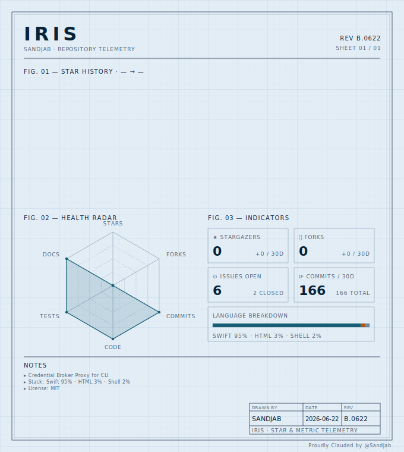

<p align="center">
  <picture>
    <source media="(prefers-color-scheme: dark)" srcset="assets/banner-dark.png">
    
  </picture>
</p>

<p align="center">
  <a href="https://github.com/Sandjab/Iris/actions/workflows/ci.yml"></a>
  <a href="https://sandjab.github.io/Iris/"></a>
  
  
  <a href="LICENSE"></a>
</p>

> **IRIS: Interception · Resolution · Injection · Substitution**

> [!NOTE]
> **v1.0.1 — latest stable release.** The 1.0 API, configuration formats, and
> behavior are stable. See the [releases](https://github.com/Sandjab/Iris/releases)
> and the [changelog](CHANGELOG.md). Feedback and bug reports are very welcome.

A minimal credential broker for macOS that lets local AI agents (like Claude Code CLI) use real credentials without ever seeing them.

Named after the Greek messenger goddess who carried messages between worlds without altering them: IRIS sits between your agent and the upstream APIs, carrying authenticated requests through while keeping the actual credentials on the far side of a trust boundary.

IRIS runs as a background LaunchAgent paired with a menu bar app. It exposes a local HTTPS proxy that intercepts outbound traffic, substitutes placeholders like `{{kc:anthropic_api_key}}` with real values pulled from the macOS Keychain, and forwards the request upstream. The agent's process environment only ever contains the placeholders.

## 📖 Documentation

**[Read the full user manual → sandjab.github.io/Iris](https://sandjab.github.io/Iris/)**

The manual is the source of truth for day-to-day use: installation, configuration,
the CLI reference, the menu bar app, the security model, provider compatibility,
and uninstall. This README is just the overview.

## Why

AI coding agents are vulnerable by design: prompt injection, malicious files in repos, and unsanitized tool outputs can all trick an agent into exfiltrating its credentials. The right fix is to put a trust boundary between the agent and the secrets — the agent does work, the broker holds the keys.

IRIS is a single-user, single-machine implementation of that pattern. No cloud, no team accounts, no telemetry.

## Features

- Local HTTPS MITM proxy with per-host whitelist (anything not whitelisted is CONNECT pass-through, no decryption).
- Per-secret `allowed_hosts` scoping: each secret can only be substituted into requests going to its authorized destinations. Anthropic key cannot leak to GitHub even if the agent tries.
- Exfiltration attempt detection with five distinct heuristics, surfaced as alerts in the menu bar app.
- Secrets stored in the macOS login Keychain with an ACL that grants silent access only to the signed `irisd` binary.
- Menu bar app for live monitoring, secret management, and alerts.
- CLI for scripting and headless usage.
- Single signed and notarized `.pkg` installer.

## How IRIS compares to existing approaches

Several mechanisms manage credentials for AI coding agents. They sit at different layers and make different trade-offs — IRIS is one point in that space, optimized for a local, single-user setup. The table below is a best-effort summary; the other projects are actively developed, so check their own docs for current capabilities.

|  | IRIS | Agent Vault (Infisical) | `apiKeyHelper` (native) | `op run` (1Password) | Claude Code sandbox |
|---|---|---|---|---|---|
| Secret never enters agent's process env | ✅ | ✅ | ❌ resolved into process | ❌ injected at launch | ❌ except Docker plugin |
| Covers MCP server tokens | ✅ | ✅ | ❌ Anthropic key only | ✅ | partial |
| Covers Bash tools (`gh`, `aws`, etc.) | ✅ | ✅ | ❌ | ✅ (env inheritance) | ✅ |
| Per-destination scoping | ✅ | partial | ❌ | ❌ | host allowlist |
| Exfiltration detection | ✅ 5 rules | audit logs | ❌ | ❌ | ❌ |
| Native macOS UI | ✅ menu bar | ❌ | ❌ | ❌ | ❌ |
| Deployment model | local, single-user | team / cloud | local | local | local |

**Where IRIS fits**: it's aimed squarely at a single developer on one Mac who wants secrets kept out of the agent's process *with* per-destination scoping *and* native visibility into what the agent tries to send. If you need shared secrets, team policies, rotation, or audit across a fleet, a server-backed solution like **Agent Vault / Infisical** is built for that and a better fit. And if you just want the Anthropic key managed with minimal setup and are fine with it living in `process.env`, `op run -- claude` is faster to get going.

## Quickstart

```bash
# Install — double-click Iris.pkg for the guided installer, or headless:
sudo installer -pkg Iris.pkg -target /

# Add your first secret (read without leaving a trace in shell history)
read -rs ANTHROPIC_KEY
printf %s "$ANTHROPIC_KEY" | iris secret add anthropic_api_key \
  --allowed-hosts api.anthropic.com --value-from-stdin

# Configure your shell once (HTTPS_PROXY + NODE_EXTRA_CA_CERTS), then point the
# tool at a placeholder — your real key stays in the Keychain.
iris shell install
export ANTHROPIC_API_KEY='{{kc:anthropic_api_key}}'

# Use Claude Code as usual — your real key never enters its process.
claude
```

The daemon and menu bar app start on their own after install and relaunch at every
login. Full install walkthrough, shell setup, and troubleshooting are in the
[user manual](https://sandjab.github.io/Iris/).

> **Heads-up:** IRIS does not coexist with Claude Code's `apiKeyHelper` (see
> [claude-code#2646](https://github.com/anthropics/claude-code/issues/2646)) — remove
> `apiKeyHelper`, `op run`, the Docker sandbox plugin, or Cordon first. `iris doctor`
> flags any leftover. Details and migration: see the manual.

## Architecture

```
┌──────────────────────────────────┐
│  Claude Code (or any HTTPS tool) │
│  ENV: ANTHROPIC_API_KEY=         │
│       "{{kc:anthropic_api_key}}" │
│  HTTPS_PROXY=127.0.0.1:8888      │
└────────────┬─────────────────────┘
             │ HTTPS (TLS via local CA)
             ▼
┌──────────────────────────────────┐         ┌─────────────────────┐
│  irisd (LaunchAgent)             │         │  login Keychain     │
│  ├─ MITM proxy   :8888           │◄────────┤  (secrets + CA key) │
│  ├─ Events SSE   :8899           │         └─────────────────────┘
│  └─ Admin RPC    unix socket     │
└────────────┬─────────────────────┘
             │ HTTPS (clean, with real credential)
             ▼
         Upstream API
         (api.anthropic.com, api.github.com, …)
```

Configuration lives in a single JSON file owned by the daemon
(`~/Library/Application Support/iris/config.json`), seeded on first run and edited
via the CLI/app — never by hand. Secrets are **not** in that file; they live in the
Keychain alongside their `allowed_hosts`. See the
[manual](https://sandjab.github.io/Iris/) for the config reference and `SPECS.md`
for the full threat model.

## Security model — in short

- The agent process never has access to plaintext credentials.
- A secret is only substituted into a request destined for one of its `allowed_hosts`; a placeholder sent anywhere else (or outside a canonical auth header) is treated as an exfiltration attempt — forwarded with the placeholder left intact and surfaced as an alert.
- The local CA private key sits in the Keychain with an ACL bound to the signed `irisd` binary; the daemon listens only on `127.0.0.1` and a `0600` Unix socket.

IRIS intercepts only processes that inherit the shell env and honor proxy
conventions (CLI tools like `claude`, `curl`, `gh`, and their children) — not GUI
apps, `launchd` services, or apps that ignore `HTTPS_PROXY`. This is intentional;
the full scope and rationale are in the [manual](https://sandjab.github.io/Iris/).

## Non-goals

- Multi-user / multi-machine support.
- Acting as a corporate egress proxy.
- Replacing 1Password CLI, vault.so, AWS Secrets Manager, or any other secrets store with multi-user features.
- Sandboxing or restricting what the agent does — `iris` is about credentials, not capability restriction.

## License

MIT — see [LICENSE](LICENSE).

## Dashboard

<picture>
  <source media="(prefers-color-scheme: dark)" srcset="assets/dashboard-dark.svg">
  
</picture>

> Drawn by [`cartouche-svg`](https://github.com/Sandjab/cartouche). The SVG above pulls fresh stats from the GitHub API and refreshes every 6 hours via [`.github/workflows/dashboard.yml`](.github/workflows/dashboard.yml).
